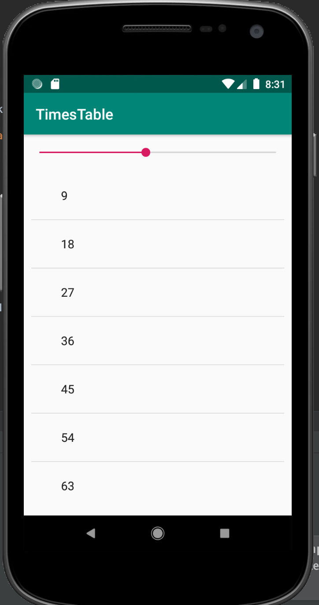

# TimesTable
 
Basic timetable app for android devices. Shows multiples numbers up to ten for each individual number. 



# Getting Started 

Users can slide the dial left and right with the left being 1 and right being 10 to get the multiplication values of each number when they are multiplied by numbers 1 - 10 from top to bottom of list. 

# Built With

- Android Studio
- TableView
- Seekbar

# Code Snippets
```
public void generateTimesTable(int timesTableNumber) {
    ArrayList<String> timesTableContent = new ArrayList<String>();

    for(int j = 1; j <= 10; j++)
    {
        timesTableContent.add(Integer.toString(j * timesTableNumber));
    }

    ArrayAdapter<String> arrayAdapter = new ArrayAdapter<String>(this, android.R.layout.simple_expandable_list_item_1, timesTableContent);

    timesTablesList.setAdapter(arrayAdapter);
}
```

The function above accepts a integer number that is taken from the seekbar and goes through a loop to calculate all the multiplication values for that number and adds it to a arraylist. The values of the Arraylist are set as list items to the tableview to be displayed. 

# Author
Muhammad Awais

Github Link: https://github.com/mawais54013